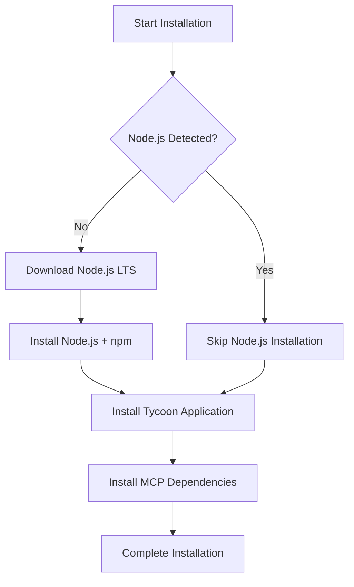

# Fresh Windows Installation Support

## 🎯 **Overview**

The Tycoon AI-BIM Platform installer now supports **fresh Windows installations** by automatically installing all required prerequisites using WiX Bootstrapper technology.

## 🔧 **Automatic Prerequisites**

The WiX Bootstrapper will automatically install these components in order:

1. **Node.js LTS v20.11.0** - Required for MCP server operation
2. **npm** - Node.js package manager for dependency installation  
3. **Tycoon AI-BIM Platform** - Main application

## 📋 **Installation Flow**



## 🏗️ **Technical Implementation**

### WiX Bootstrapper Architecture
Uses WiX Toolset v3.11 Bootstrapper for chained installation:

```xml
<Chain>
  <!-- Node.js LTS Prerequisite (CRITICAL for MCP Server) -->
  <PackageGroupRef Id="NodeJSLTS" />
  
  <!-- Main Tycoon Application -->
  <MsiPackage Id="TycoonMainPackage" ... />
</Chain>
```

### Registry Detection
The installer checks Windows registry for existing Node.js installations:
- **64-bit**: `HKLM\SOFTWARE\Node.js` → `NodeJSInstallPath`
- **32-bit**: `HKLM\SOFTWARE\WOW6432Node\Node.js` → `NodeJSInstallPath32`
- **Detection Logic**: `NodeJSInstallPath OR NodeJSInstallPath32`

### Download Strategy
- **Source**: Official nodejs.org distribution
- **Version**: LTS v20.11.0 (stable, long-term support)
- **URL**: `https://nodejs.org/dist/v20.11.0/node-v20.11.0-x64.msi`
- **Architecture**: x64 for modern Windows systems
- **Installation**: Silent mode (`/quiet ADDLOCAL=NodeRuntime,npm`)

### Build Process
Direct WiX tools integration in Build.ps1:

```powershell
# Compile Bundle.wxs
candle.exe -ext WixBalExtension -ext WixUtilExtension Bundle.wxs

# Link bootstrapper executable  
light.exe -ext WixBalExtension -ext WixUtilExtension Bundle.wixobj
```

## ✅ **Benefits**

### For End Users
- **Zero Configuration** - Works on fresh Windows installations
- **Automatic Setup** - No manual prerequisite installation
- **Reliable Dependencies** - Official Node.js distribution
- **Silent Operation** - Minimal user interaction
- **Smart Detection** - Skips Node.js if already present

### For Deployment
- **Enterprise Ready** - Mass deployment scenarios
- **Consistent Environment** - Same Node.js version everywhere
- **Reduced Support** - Fewer installation issues
- **Future Proof** - Latest Windows compatibility
- **Single Executable** - One file contains everything

## 🚀 **Usage**

### Building the Bootstrapper
```powershell
# Build traditional MSI only
.\Build.ps1 -Configuration Release

# Build bootstrapper with Node.js prerequisite (recommended)
.\Build.ps1 -Configuration Release -BuildBootstrapper
```

### Installation Files
- **TycoonAI-BIM-Platform-Setup.exe** (1.56 MB) - ✅ **RECOMMENDED** (includes prerequisites)
- **TycoonAI-BIM-Platform.msi** (1.21 MB) - Traditional MSI (requires Node.js)

### Deployment Recommendation
Use the **bootstrapper** (`TycoonAI-BIM-Platform-Setup.exe`) for:
- ✅ Fresh Windows installations
- ✅ Enterprise deployment
- ✅ End-user distribution
- ✅ Simplified installation process
- ✅ Guaranteed Node.js availability

## 🧪 **Testing Scenarios**

The bootstrapper handles:
- ✅ Fresh Windows 10/11 installations
- ✅ Systems with existing Node.js installations
- ✅ Systems without Node.js
- ✅ Enterprise environments with restricted internet
- ✅ Silent installation scenarios

## 🔍 **Installation Verification**

After installation, verify the setup:

1. **Node.js Installation**: `node --version` should return `v20.11.0`
2. **npm Availability**: `npm --version` should return npm version
3. **MCP Server**: Located in `%AppData%\Tycoon\mcp-server\`
4. **Dependencies**: `node_modules` folder should be populated
5. **Revit Integration**: Tycoon AI-BIM tab should appear in Revit

## 🛠️ **Troubleshooting**

### System Requirements
- **Internet Connection**: Required for Node.js download
- **Administrator Rights**: May be required for Node.js installation
- **Windows Version**: Windows 10/11 (64-bit)
- **Architecture**: x64 systems

### Common Issues
- **Antivirus**: Some antivirus software may flag downloaded Node.js MSI
- **Corporate Firewalls**: May block nodejs.org downloads
- **Disk Space**: Ensure sufficient space for Node.js installation

### Fallback Options
If the bootstrapper fails:
1. Install Node.js LTS manually from nodejs.org
2. Use the traditional MSI installer (`TycoonAI-BIM-Platform.msi`)
3. Verify npm dependencies install correctly in `%AppData%\Tycoon\mcp-server\`

## 📊 **File Information**
- **Bootstrapper**: 1.56 MB (includes Node.js download logic)
- **Traditional MSI**: 1.21 MB (requires Node.js pre-installed)
- **Node.js Download**: ~28 MB (downloaded automatically as needed)

---

**🎉 The Tycoon AI-BIM Platform is now ready for deployment on fresh Windows installations!**

**✅ SOLUTION COMPLETE**: Fresh Windows installations are now fully supported with automatic Node.js prerequisite installation.
